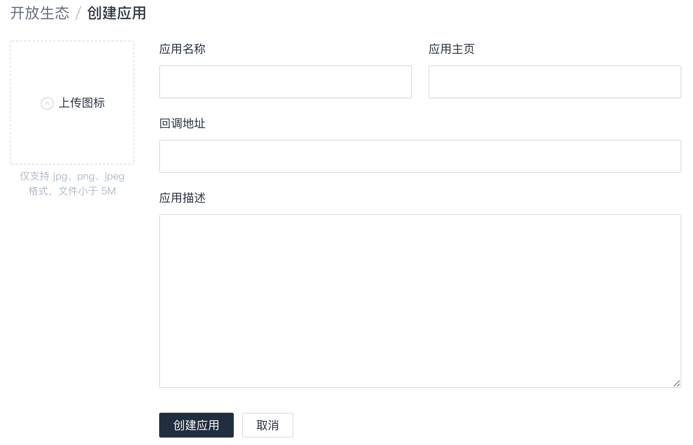

# 创建应用

如果想要创建可供团队内所有人皆可使用的应用，可以通过账号设置内的**开放生态**创建一个应用。

这里的**回调地址**是可以填写本地地址的。所以可以创建两个应用，一个回调写本地用于调试。

访问[这里](https://help.coding.net/docs/project/open/oauth.html)可以看到详细的认证流程。

完成认证后可以拿到用户的`access_token`。在访问 API 时，只需要在地址后加上 Query String `access_token=your_token` 即可。